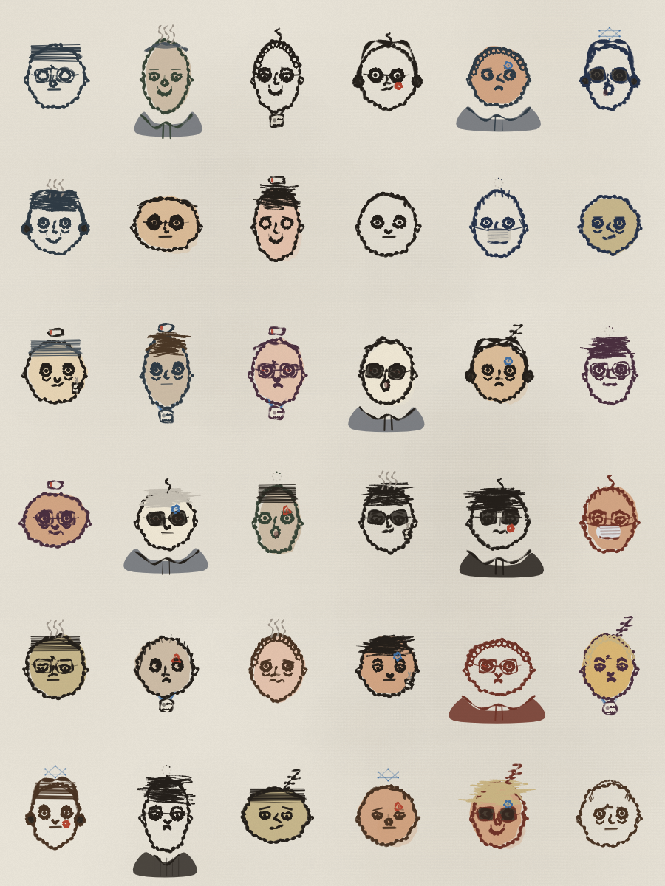

# Worker Lab

**A hand-drawn "AI worker" avatar generator — written in pure JavaScript. No AI image models. Every face is code.**

Sleep-deprived engineers, burnout smoke, 1%-battery brains, neural halos, "0 tokens left" — an infinite standup of the people (allegedly) building the future, each one drawn line-by-line from a random seed.



<p align="center"><em>One seed → 36 coworkers. No two alike. All drawn by ~700 lines of JavaScript.</em></p>

<p align="center"><strong>▶︎ Play with it live: <a href="https://yeje-cpu.github.io/ai-worker-lab/">yeje-cpu.github.io/ai-worker-lab</a></strong></p>

---

## Why this exists

[@mannay](https://x.com/mannay) posted a lovely idea — *"you can just draw faces with javascript"* — a procedural doodle-face generator where every feature is hand-coded geometry, roughed up to look drawn by hand.

That idea was too fun to just scroll past. So this is an independent, **clean-room reimplementation of the technique**, re-skinned into a theme I couldn't resist: the **AI worker**. Same core trick, different cast — tired eyes instead of neutral ones, ANC headphones and lanyards instead of plain heads, and a rarity panel that ranks you from `intern` to `10x eng`.

**Not** an AI image generator. There is no model, no API call, no `prompt`. Just a seeded random number generator, some trigonometry, and a jittery ink brush faking a shaky human hand.

## What you get

🎲 **Deterministic** — every avatar is a number. Same seed, same worker, forever. Type `404`, share `404`, your friend gets the exact same burnt-out soul.

🧩 **Lock any feature** — 10 dropdowns (skull, eyes, brows, nose, mouth, hair, status, gear, eyewear, meme). Leave on `(auto)` to roll, or pin one to design on purpose.

🔄 **It turns its head** — `yaw` / `pitch` sliders rotate a crude 3D skull; the features are pinned on top and slide along with it. Naïve on purpose — that's the charm.

🏅 **Rarity, gamified** — every feature carries a drop-rate. Rack up rare parts and your `burnout` score climbs from `intern` → `junior` → `senior` → `staff` → `10x eng`.

🖼️ **Two views** — **Desk** for one worker in high detail, **Standup** for a 36-face contact sheet. Click any face in the standup to open it at the desk.

⤓ **Export PNG** — a single 4× portrait, or the whole 36-worker standup sheet. Plain browser download, works anywhere.

The whole thing is **one self-contained `index.html`** — no build, no dependencies, no network. Open it by double-clicking, or host it as a static file.

## The parts bin

| category | some of the variants |
|---|---|
| **status** (head-top) | burnout smoke · `zzz` · buffering spinner · 1% battery · neural halo · bald-spot · stray ahoge |
| **gear** | ANC headphones · caffeine cup · lanyard ID badge · face mask · hoodie · flannel |
| **eyes** | dead-fish · eye-bags · bloodshot · hollow · side-eye · focused |
| **meme sticker** | `>_` prompt · API node · `0 tokens` · `500` error |
| **eyewear** | round · square · shades |

Everything is weighted, so commons are common and the good stuff is rare — which is what makes the rarity panel mean something.

## How it works

Three layers, and only the first two care about the theme:

1. **Parts library** — each feature is a small painter function returning local 2D/3D points (an eye = two arcs + a filled pupil; a nose = one long curve down to the tip). Multiple variants per feature.
2. **Assembly rules** — a seeded [mulberry32](https://en.wikipedia.org/wiki/Xorshift) RNG picks which variant, where it sits, and what colour it is. This is the "DNA → body" step.
3. **Hand-drawn ink engine** — the part that sells it. Catmull-Rom smoothing, per-point sine-wave jitter, stroke width that breathes along the line, a double inking pass with a deliberate offset, plus a paper texture and film grain on top. This layer is theme-agnostic; swap layers 1–2 and you can draw anything in the same style.

Head rotation is deliberately cheap: a rough 3D head sits underneath, features are stuck on at different depths (the nose sticks out furthest, so it swings most), and everything re-projects as you drag the sliders.

## Run it

It's a single static file. Any of these work:

```bash
# 1. simplest — just open it
open index.html

# 2. or serve it (any static server)
python3 -m http.server 8144
# → http://localhost:8144
```

Deploy it as a static site to Vercel / Netlify / GitHub Pages / Cloudflare Pages — there is nothing to build.

## Credit

The seed of this whole thing is **[@mannay](https://x.com/mannay)** and his *"you can just draw faces with javascript"* / *"everything is code"* doodles. The parametric-parts + fake-hand-drawn-ink approach is his; go look at his work, it's delightful.

This repo is an **independent clean-room reimplementation** of that *technique* (no source was copied — his generator isn't open source), re-themed to AI workers, with new part libraries, a rarity system, head rotation, and PNG export added on top.

## License

[MIT](LICENSE) — do whatever you want, a credit link back is always appreciated.
