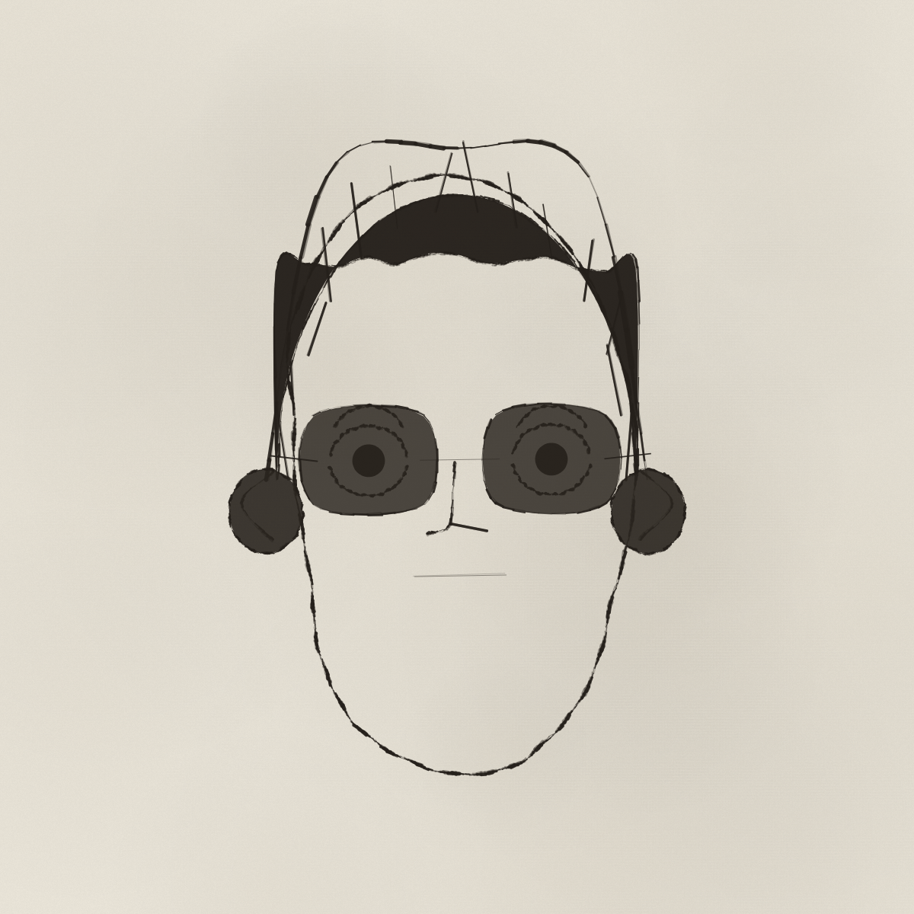
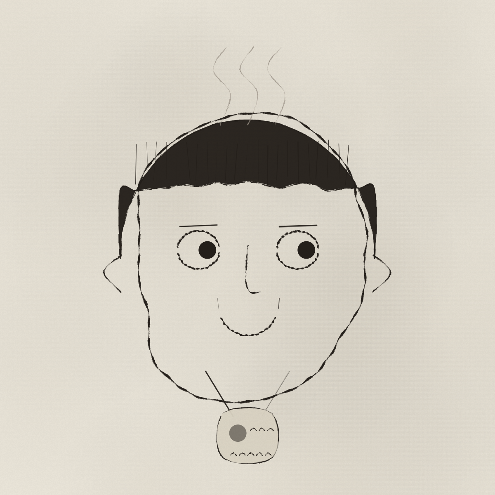
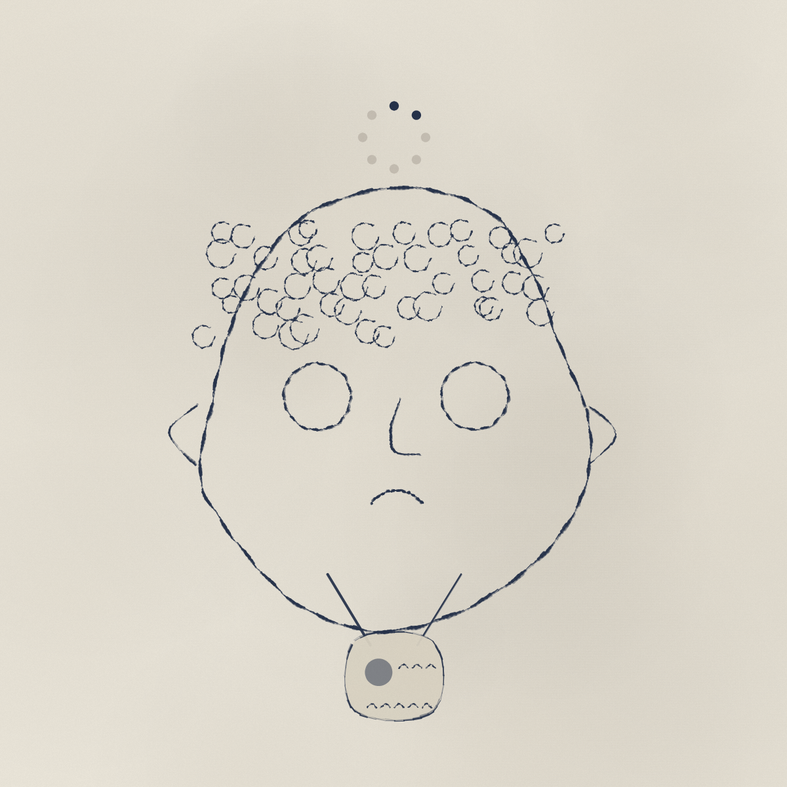
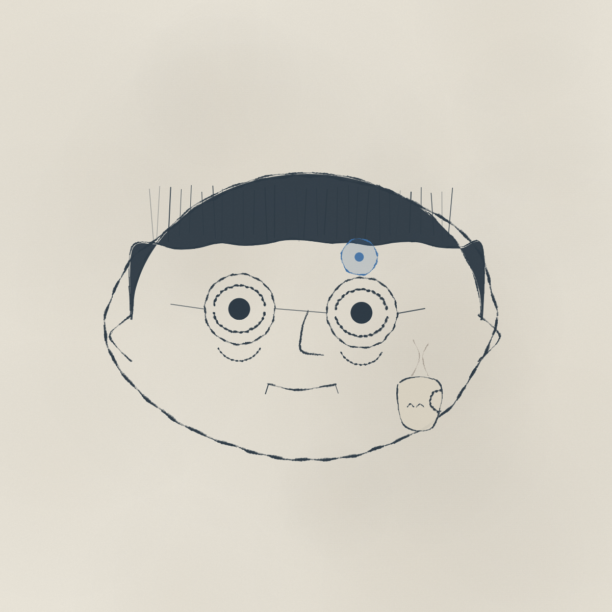

<p align="right"><strong>English</strong> · <a href="README.zh.md">中文</a></p>

# inkheads

**Seed → a unique hand-drawn doodle avatar. Pure JavaScript — no AI image models, every face is code.**

<p align="center">
  
  
  
  
</p>

<p align="center"><em>Type a number, get a person. Same number, same person — forever. All drawn by ~700 lines of JavaScript.</em></p>

<p align="center"><strong>▶︎ Play with it live: <a href="https://yeje-cpu.github.io/inkheads/">yeje-cpu.github.io/inkheads</a></strong></p>

---

## What is this

A tiny generator that turns a number into a hand-drawn face. Every feature — the wobbly skull, the solid-ink hair, the tired eyes — is code-drawn geometry roughed up to look like it came off a pen, not a plotter.

It started from [@mannay](https://x.com/mannay)'s lovely *"you can just draw faces with javascript"* doodles. **inkheads** is an independent, clean-room take on that technique, re-cast as the burnt-out coders of the AI era: burnout smoke, 1%-battery brains, "0 tokens left", ANC headphones, lanyards, and a rarity panel that ranks each hire from `intern` to `10x eng`.

**Not** an AI image generator. No model, no API call, no `prompt`. Just a seeded random number generator, some trigonometry, and a jittery ink brush faking a shaky human hand.

## Use it as avatars

Because a face is fully determined by its seed, inkheads doubles as a **zero-dependency avatar / identicon generator** — the same job GitHub's default avatars, Gravatar, or DiceBear do, but hand-drawn:

```js
// any string (username / email / id) is hashed into a stable, unique face
inkheads.render(canvas, user.email);
```

Unique per user, identical on every visit, **all client-side** — no server, no real photos, no AI, no privacy headache. Great for default profile pictures, mock-up faces in a design, or a trait-based PFP collection (the rarity system is already built in).

…and honestly, it's mostly just fun to sit there hitting **random**.

## What you get

🎲 **Deterministic** — every avatar is a number. Type `404`, share `404`, your friend gets the exact same soul.

🧩 **Lock any feature** — 10 dropdowns (skull, eyes, brows, nose, mouth, hair, status, gear, eyewear, meme). Leave on `(auto)` to roll, or pin one to design on purpose.

🔄 **It turns its head** — `yaw` / `pitch` sliders rotate a crude 3D skull; the features are pinned on top and slide along with it. Naïve on purpose — that's the charm.

🏅 **Rarity, gamified** — every feature carries a drop-rate. Rack up rare parts and your score climbs from `intern` → `junior` → `senior` → `staff` → `10x eng`.

🖼️ **Two views** — **Desk** for one face in high detail, **Standup** for a 36-face contact sheet. Click any face in the standup to open it at the desk.

⤓ **Export PNG** — a single 4× portrait, or the whole 36-face sheet. Plain browser download, works anywhere.

The whole thing is **one self-contained `index.html`** — no build, no dependencies, no network. Double-click to open, or host it as a static file.

## The parts bin

| category | some of the variants |
|---|---|
| **status** (head-top) | burnout smoke · `zzz` · buffering spinner · 1% battery · neural halo · bald-spot · stray ahoge |
| **gear** | ANC headphones · caffeine cup · lanyard ID badge · face mask · hoodie · flannel |
| **eyes** | dead-fish · eye-bags · bloodshot · hollow · side-eye · focused |
| **meme sticker** | `>_` prompt · API node · `0 tokens` · `500` error |
| **eyewear** | round · square · shades |

Everything is weighted, so commons are common and the good stuff is rare — which is what makes the rarity panel mean something.

## How it works

Three layers, and only the first two care about the theme:

1. **Parts library** — each feature is a small painter function returning local 2D/3D points (an eye = two arcs + a filled pupil; a nose = one long curve down to the tip). Multiple variants per feature.
2. **Assembly rules** — a seeded [mulberry32](https://en.wikipedia.org/wiki/Xorshift) RNG picks which variant, where it sits, and what colour it is. This is the "DNA → body" step.
3. **Hand-drawn ink engine** — the part that sells it. Catmull-Rom smoothing, per-point jitter, uneven "breathing" stroke width, a rough multi-pass dry-brush edge, solid-ink hair fills with hatch/curl texture, plus paper grain on top. This layer is theme-agnostic; swap layers 1–2 and you can draw anything in the same style.

Head rotation is deliberately cheap: a rough 3D head sits underneath, features are stuck on at different depths (the nose sticks out furthest, so it swings most), and everything re-projects as you drag the sliders.

## Run it

It's a single static file. Any of these work:

```bash
# 1. simplest — just open it
open index.html

# 2. or serve it (any static server)
python3 -m http.server 8144
# → http://localhost:8144
```

Deploy it as a static site to GitHub Pages / Vercel / Netlify / Cloudflare Pages — there is nothing to build.

## Credit

The seed of this whole thing is **[@mannay](https://x.com/mannay)** and his *"you can just draw faces with javascript"* / *"everything is code"* doodles. The parametric-parts + fake-hand-drawn-ink approach is his; go look at his work, it's delightful.

This repo is an **independent clean-room reimplementation** of that *technique* (no source was copied — his generator isn't open source), re-themed to AI-era coders, with new part libraries, a rarity system, head rotation, and PNG export added on top.

## License

[MIT](LICENSE) — do whatever you want, a credit link back is always appreciated.
